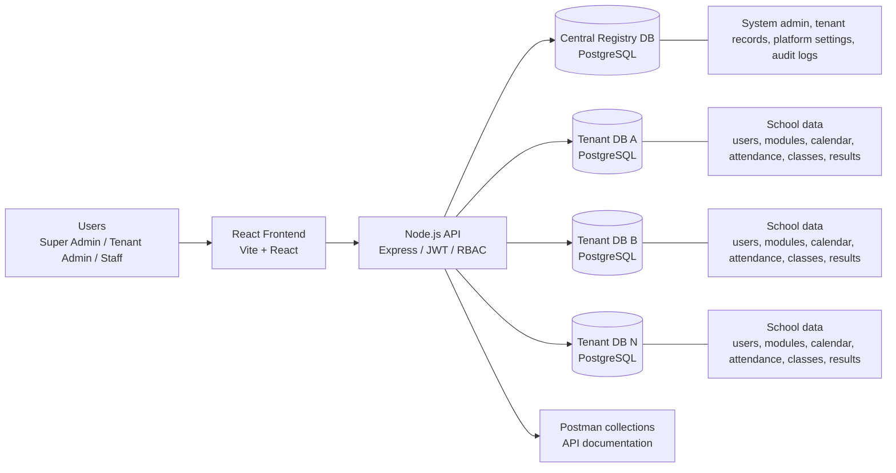

# School Management System

Multi-tenant school management SaaS built with a Node.js backend, a React frontend, and PostgreSQL databases. The platform uses a central registry database for system administration and tenant metadata, while each tenant receives an isolated PostgreSQL database for its own school data.

## Architecture



### How it works

- The central database stores system admins, tenant registry records, shared settings, and platform-level configuration.
- Each tenant is provisioned with a dedicated PostgreSQL database and its own schema tables.
- JWT tokens are issued for system admins, tenants, and staff users.
- Requests for tenant data are routed through tenant-aware middleware that attaches the correct tenant database pool.
- The frontend uses the API base URL from Vite environment variables and stores auth state in browser storage.

## Project Structure

```text
.
├── backend/
│   ├── APIDOCS/                # Postman collection(s) for API testing
│   ├── migrations/             # db-migrate migration scripts
│   ├── scripts/                # One-off database and admin utilities
│   ├── src/
│   │   ├── config/             # Database pools and central DB initialization
│   │   ├── controller/         # Request handlers
│   │   ├── database/           # db-migrate config and helpers
│   │   ├── middleware/         # Auth and tenant-context middleware
│   │   ├── routing/            # API routes under /v1
│   │   ├── server/             # Express bootstrap and server startup
│   │   ├── services/           # Business logic and database access
│   │   └── validation/         # Joi validation schemas
│   ├── uploads/                # Generated files and media uploads
│   └── package.json
├── frontend/
│   ├── src/
│   │   ├── api/                # API client wrappers
│   │   ├── components/        # Reusable UI components
│   │   ├── context/           # Auth, tenant, settings, theme contexts
│   │   ├── pages/             # Admin, super-admin, and tenant pages
│   │   ├── routes/            # React Router route definitions
│   │   ├── utils/             # Formatting and shared helpers
│   │   └── main.tsx|main.jsx  # Frontend entrypoints
│   ├── public/
│   └── package.json
└── README.md
```

## Local Development Setup

### Prerequisites

- Node.js 18+ recommended
- PostgreSQL 14+ or newer
- `npm`

### 1. Clone and install dependencies

```bash
cd backend
npm install

cd ../frontend
npm install
```

### 2. Configure the backend

Create a `.env` file in the `backend/` directory.

### 3. Start the backend

```bash
cd backend
npm run dev
```

The backend starts on port `5000` by default.

### 4. Start the frontend

```bash
cd frontend
npm run dev
```

The frontend runs on Vite's development server, typically `http://localhost:5173`.

### 5. Optional database tasks

- Run backend migrations: `npm run migrate`
- Seed initial data: `npm run seed`
- Update tenant schemas: `npm run update-tenant-schemas`
- Repair tenant modules: `npm run fix-tenant-modules`

## Database Configuration

The application uses PostgreSQL in two tiers:

### Central registry database

Used for:

- `system_admin`
- `tenant`
- shared `settings`
- `platform_settings`
- centralized school profile metadata

This database is initialized automatically on backend startup by `initializeCentralDatabase()`.

### Tenant databases

Each tenant gets a separate PostgreSQL database created through the tenant provisioning flow. The tenant database is initialized with tables such as:

- `tenant_users`
- `tenant_modules`
- `tenant_logs`
- academic calendar tables
- `roles`, `permissions`, and `role_permissions`
- school profile and infrastructure tables
- attendance, classes, sections, rooms, results, reports, and related school modules

### Database connection behavior

- The central pool uses the main PostgreSQL connection values.
- Tenant pools are created per tenant ID and database name.
- Tenant DB host, port, user, and password can be overridden with dedicated tenant variables.
- Connection pooling is controlled through `DB_POOL_MIN` and `DB_POOL_MAX`.

## Environment Variables

Backend variables referenced by the codebase:

| Variable | Purpose |
| --- | --- |
| `DB_HOST` | PostgreSQL host for the central registry database |
| `DB_PORT` | PostgreSQL port |
| `DB_NAME` | Central registry database name |
| `DB_USER` | Central registry database user |
| `DB_PASSWORD` | Central registry database password |
| `DB_POOL_MIN` | Minimum PostgreSQL pool size |
| `DB_POOL_MAX` | Maximum PostgreSQL pool size |
| `TENANT_DB_HOST` | Optional tenant database host override |
| `TENANT_DB_PORT` | Optional tenant database port override |
| `TENANT_DB_USER` | Optional tenant database user override |
| `TENANT_DB_PASSWORD` | Optional tenant database password override |
| `JWT_SECRET` | Secret used to sign and verify JWTs |
| `JWT_EXPIRE_ADMIN` | Token lifetime for system admins |
| `JWT_EXPIRE_TENANT` | Token lifetime for tenant admins |
| `JWT_EXPIRE_USER` | Token lifetime for tenant staff/users |
| `NODE_ENV` | Runtime mode such as `development` or `production` |
| `ENABLE_AUTO_MIGRATE` | When `true`, runs `db-migrate up` during startup |
| `FRONTEND_BASE_URL` | Used in login URLs returned from the API |
| `API_BASE_URL` | Used by document generation and frontend integrations |
| `PORT` | Used by some backend utilities and generated links |

Frontend variables referenced by the codebase:

| Variable | Purpose |
| --- | --- |
| `VITE_API_BASE_URL` | Base URL for the backend API |
| `VITE_APP_NAME` | Display name used in the UI |

Example backend `.env`:

```env
NODE_ENV=development
DB_HOST=localhost
DB_PORT=5432
DB_NAME=school_registry
DB_USER=postgres
DB_PASSWORD=postgres
DB_POOL_MIN=1
DB_POOL_MAX=10
TENANT_DB_HOST=localhost
TENANT_DB_PORT=5432
TENANT_DB_USER=postgres
TENANT_DB_PASSWORD=postgres
JWT_SECRET=change-this-secret
JWT_EXPIRE_ADMIN=7d
JWT_EXPIRE_TENANT=24h
JWT_EXPIRE_USER=24h
FRONTEND_BASE_URL=http://localhost:5173
ENABLE_AUTO_MIGRATE=false
```

Example frontend `.env`:

```env
VITE_API_BASE_URL=http://localhost:5000
VITE_APP_NAME=SchoolMIS
```

## Tenant Onboarding Process

Tenant provisioning is handled by the backend auth service and admin-only auth routes.

1. A system admin calls the tenant creation API.
2. The backend validates the tenant slug, email, database name, and module list.
3. The backend creates a new PostgreSQL database for the tenant.
4. The tenant record is inserted into the central `tenant` registry table.
5. The tenant database is initialized with the tenant schema.
6. A tenant admin user is created inside the new tenant database.
7. Default modules are stored in both the central record and the tenant database.
8. The admin receives the tenant login URL.

Key API flow:

- `POST /v1/auth/tenant/create` creates a new tenant
- `GET /v1/auth/tenant/all` lists tenants for admins
- `GET /v1/auth/tenant/:id` fetches a tenant record
- `PATCH /v1/auth/tenant/:id/status` enables or disables a tenant
- `DELETE /v1/auth/tenant/:id` soft-deletes a tenant record
- `DELETE /v1/auth/tenant/:id/permanent` removes the tenant and drops its database

## API Documentation

API routes are mounted under `/v1`.

### Authentication and admin APIs

- `POST /v1/auth/admin/login`
- `POST /v1/auth/tenant/login`
- `POST /v1/auth/staff/login`
- `POST /v1/auth/login`
- `POST /v1/auth/tenant/create`
- `GET /v1/auth/tenant/all`
- `GET /v1/auth/tenant/:id`

### Core tenant APIs

- Calendar, attendance, classes, sections, rooms, students, employees, departments, fees, results, roles, permissions, users, settings, daily reports, devices, teachers, leave, and dashboard routes are exposed through the route index under `/v1`.

### Public and special routes

- `GET /v1/health` checks service availability
- `GET /v1/results/public` exposes public result lookup
- `GET /v1/settings/audit-logs` and `GET /v1/settings/audit-stats` are admin-only audit endpoints

### API docs source

- Postman collection: [backend/APIDOCS/Calendar_API_Collection.postman_collection.json](backend/APIDOCS/Calendar_API_Collection.postman_collection.json)
- The collection currently documents the calendar API, including AD and BS calendar queries.

## Production Deployment Steps

1. Provision the central PostgreSQL database and make sure the application user can create databases for tenants.
2. Set production environment variables for the backend and frontend.
3. Run backend migrations if needed: `npm run migrate`.
4. Build the frontend: `npm run build` in `frontend/`.
5. Start the backend with a process manager such as PM2, systemd, or Docker.
6. Serve the frontend build through a static host or CDN.
7. Put the backend behind a reverse proxy such as Nginx or an application gateway.
8. Confirm file upload storage, database backups, and log retention are configured.
9. Verify CORS origins, JWT secrets, and tenant database credentials in production.

Recommended production checks:

- Ensure `ENABLE_AUTO_MIGRATE` is only enabled if startup migrations are part of your release process.
- Confirm tenant database creation is permitted only for privileged admin flows.
- Ensure uploads are stored on persistent disk or object storage.

## Security Considerations

- Use a strong, unique `JWT_SECRET` and rotate it carefully.
- Keep tenant isolation at the database level and avoid cross-tenant queries outside the central registry.
- Restrict `POST /v1/auth/tenant/create` and tenant-management endpoints to system admins only.
- Validate tenant slugs, emails, and module lists before provisioning.
- Protect the `X-Tenant-ID` header path so admins cannot attach to arbitrary tenant databases without authorization.
- Keep CORS origins restricted to trusted frontend hosts.
- Store passwords using bcrypt hashes only; never log or persist plaintext passwords.
- Limit uploaded file types and sizes, and move long-term storage to managed object storage.
- Add rate limiting and stronger audit coverage around auth and provisioning paths if the deployment is internet-facing.

## Future Improvements

- Add a dedicated tenant provisioning workflow with retries and rollback if database creation succeeds but schema initialization fails.
- Split the central registry and tenant bootstrap logic into clearer service boundaries.
- Add OpenAPI/Swagger documentation alongside the existing Postman collection.
- Introduce automated integration tests for tenant onboarding, login, and cross-tenant isolation.
- Move file storage to S3-compatible or cloud-native object storage for production scalability.
- Add background jobs for backups, cleanup, and periodic tenant schema maintenance.
- Expand observability with structured logs, metrics, and alerting.
- Add a sample `.env.example` for both backend and frontend.

## License

No explicit license file was present in the repository at the time of writing.
